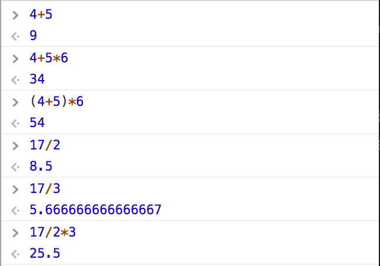
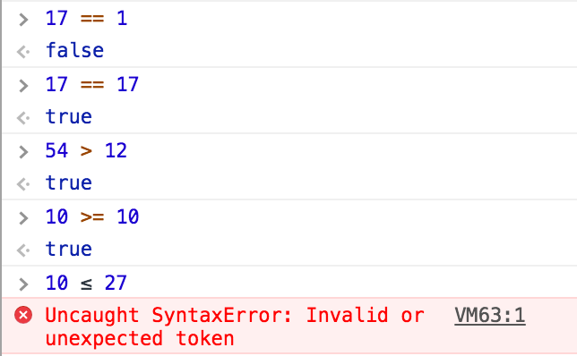
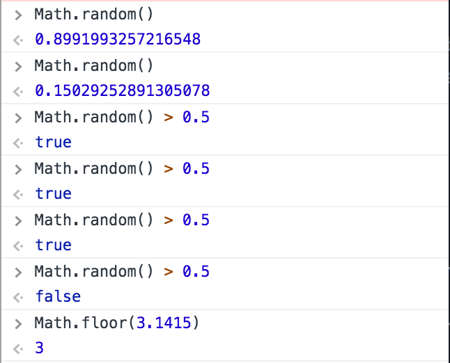
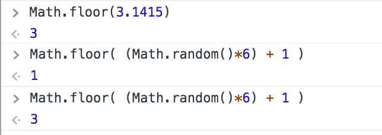

# Intro to Comp Media - Sept 6

Prof: **[Allison Parrish](http://www.decontextualize.com/)**

> Class about interactive computer programming.

> The "complicated" aura around programming is the result of **marketing**. Before that, it was almost an exclusive female oriented job.

### Outline
1. Intro
2. console
3. more about programming
4. bees (?) *metaphor for learning to program*
5. Schedule & Syllabus
6. drawing stuff
7. homework

### First things first: about the class
- [Github](http://github.com/ITPNYU/ICM-2017)
  - [Homework Wiki](https://github.com/ITPNYU/ICM-2017/wiki/Homework-Allison-Wednesday)
- [Allison's notes](http://creative-coding.decontextualize.com)
- [Google Group](https://groups.google.com/a/itp.nyu.edu/forum/#!overview)
- [p5.js Web Editor](http://alpha.editor.p5js.org/)

Usually you have to watch Daniel Shiffman's videos, and then we comment them. Allison will refer to her notes for classes. **JavaScript** is supported universally in (almost) every browser, so most of the class is going to happen on the web browser. You can use it to program everything, but for the most part it is used to program web-based stuff (to make thingies happen on your webpage!). Aaaaand, you can type javascript DIRECTLY to your website!

### Basic vocabulary
So... in your web browser go to `about:blank` to open a blank website and go to the *web/javascript console*. There you can give your browser commands directly with javascript expressions! This is a **REPL** interface: **Read, Evaluate, Print, Loop** (read = input, print = display).

An *expression* is a way to ask a computer a question. But you need the correct syntax to phrase them. Then, the computer *evaluates* the expression, giving you the corresponding *value* (answer).

*Operators* are symbols, which in conjunction with numbers/variables, are evaluated. JavaScript follows the usual order of operations: "PEMDAS". For that, it automatically *parses* longer expressions to simple ones and evaluates them in a particular order.
Decimal numbers are *floating point numbers* (ex: 15.654), instead of *integers* (ex: 7).
>A single number is also an expression that evaluates to itself.

#### Operators
- `+`: addition
- `-`: subtraction
- `*`: multiplication
- `/`: division
- `==`: equality (returns `true` or `false`)
- `>` / `<`: greater/less than
- `>=` / `<=`: greater/less than or equal to (no UNICODE characters!)

Some of these functions give *boolean* values, which are true or false. This will be really useful later on to evaluate and create programming "paths".

#### "Words" of the language
> CAPITALIZATION MATTERS!!! "Math" is not the same as "math".

Built in expressions (objects, functions, etc) of any specific programming language. *functions* are pre-written pieces of code that you can *call* or *run* to make an evaluation and get a value.

Ex: `Math.random()` returns a number between 0 and 1.

### Examples
**Ex 1**: Program a coin flip only with the tools we've learned up to now
>"What does it mean for a coin to be heads or tails?" "What information I need to give and to get back?"

`Math.random() > 0.5`

**Ex 2**: Simulate a six-sided dice

- To have numbers between 1 and 6: `(Math.random() * 6) + 1`
- Now we need to drop the decimals! How do we find out how to *truncate*? **GOOGLE IT!**
	- *Think about how a programmer would phrase that question and go for it!*
	- `Math.floor(number)` : Rounds a number to the nearest integer
- Then, we need to give it the previous number we calculated
  - Anywhere you see a functions a number, you can also put an expression that evaluates to a number!
- `Math.floor( (Math.random()*6) + 1 )`

> You're not supposed to KNOW those functions. Learning to program is learning how to search for these language-specific functions.

### p5.js library
Is a *library* of JavaScript that runs on it, but has an array of extra functions that make your life easier. It is focused on visual artists. (Other libraries are d3, react, angular, node.js... and thousands more!)
> Libraries are collection of functions that someone created and collect them for others to use.

Running JavaScript on a web browser you can edit the content of the web site (local copy). p5.js has built-in functions to draw on the browser.

Because it's convenient, we're going to use the [p5.js web editor: alpha.editor.p5js.org](http://alpha.editor.p5js.org). **Sign up for an account to save your work.** On the left hand, you can write your code; and on the right hand, you run it. You can  *Sketches* are p5js files you run on your web browser. Computer screens are laid out as a grid of *pixels*, where **(0,0) is the upper-left hand corner**.

p5.js needs a *setup function* and a *draw function*. On the *setup* you specify the *size* (and *background*) of the sketch.
- `createCanvas(width, height);`
- `background(color);`
  - `color` values are expressed between 0-255.

To draw on the sketch, you can use some of these functions:
- `ellipse(posX , posY, width, height);` ellipse centered on (posX, posY).
- `rect(posX, posY, width, height);` rectangle with the upper-left corner on (posX, posY).
- `quad(x1, y1, x2, y2, x3, y3, x4, y4)` quadrilateral shape

To "change the color on your paintbrush" you can use:
- `fill(color)`
- `stroke(color)`

**Syntax**: JavaScript calls the functions in the order they are written. If you call the *background* after drawing something, it will get covered by the background!

> No one remembers all the parameters of the functions. You just look them up on the language-specific **[reference](https://p5js.org/reference/)**.

### Assignment
- Watch the videos!
- Create your own drawing with only these simple commands
- Write a blog post on **how computation applies to your interests**.
