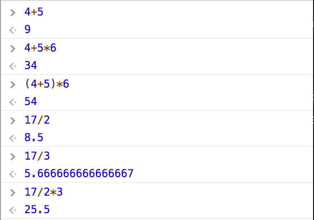
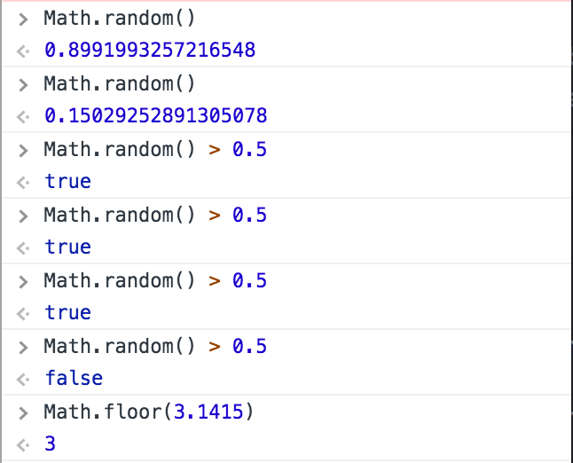
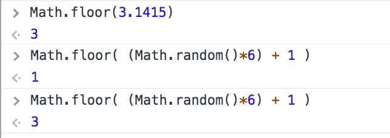

# Intro to Comp Media - Sept 6

Prof: **Allison Parrish**

> Class about interactive computer programming.

> The "complicated" aura around programming is the result of **marketing**. Before that, it was almost an exclusive female oriented job.

### Outline
1. Intro
- console
- more about programming
- bees (?)
- Schedule & Syllabus
- drawing stuff
- homework

### First things first: about the class
- [Github](http://github.com/ITPNYU/ICM-2017)
  - [Homework Wiki](https://github.com/ITPNYU/ICM-2017/wiki/Homework-Allison-Wednesday)
- [Allison's notes](http://creative-coding.decontextualize.com)
- [Google Group](https://groups.google.com/a/itp.nyu.edu/forum/#!overview)
- [p5.js Web Editor](http://alpha.editor.p5js.org/)

Usually you have to watch Daniel Shiffman's videos, and then we comment them. Allison will refer to her notes for classes. **JavaScript** is supported universally in (almost) every browser, so most of the class is going to happen on the web browser. You can use it to program everything, but for the most part it is used to program web-based stuff (to make thingies happen on your webpage!). Aaaaand, you can type javascript DIRECTLY to your website!

### Basic vocabulary
So... in your web browser go to `about:blank` to open a blank website and go to the *web/javascript console*. There you can give your browser commands directly with javascript expressions! This is a **REPL** interface: **Read, Evaluate, Print, Loop** (read = input, print = display).

An *expression* is a way to ask a computer a question. But you need the correct syntax to phrase them. Then, the computer *evaluates* the expression, giving you the corresponding *value* (answer).

*Operators* are symbols, which in conjunction with numbers/variables, are evaluated. JavaScript follows the usual order of operations: "PEMDAS". For that, it automatically *parses* longer expressions to simple ones and evaluates them in a particular order.
Decimal numbers are *floating point numbers* (ex: 15.654), instead of *integers* (ex: 7).
>A single number is also an expression that evaluates to itself.

#### Operators
- `+`: addition
- `-`: subtraction
- `*`: multiplication
- `/`: division
- `==`: equality (returns `true` or `false`)
- `>` / `<`: greater/less than
- `>=` / `<=`: greater/less than or equal to (no UNICODE characters!)

<boolean values (true or false)>

#### "Words" of the language
> CAPITALIZATION MATTERS!!! "Math" is not the same as "math".

Built in expressions (objects, functions, etc) of any specific programming language. *functions* are pre-written pieces of code that you can *call* or *run* to make an evaluation and get a value.

Ex: `Math.random()` returns a number between 0 and 1.

### Examples
**Ex 1**: Program a coin flip only with the tools we've learned up to now
>"What does it mean for a coin to be heads or tails?" "What information I need to give and to get back?"

`Math.random() > 0.5`

**Ex 2**: Simulate a six-sided dice

- To have numbers between 1 and 6: `(Math.random() * 6) + 1`
- Now we need to drop the decimals! How do we find out how to *truncate*? **GOOGLE IT!**
	- *Think about how a programmer would phrase that question and go for it!*
	- `Math.floor(number)` : Rounds a number to the nearest integer
- Then, we need to give it the previous number we calculated
  - Anywhere you see a functions a number, you can also put an expression that evaluates to a number!
- `Math.floor( (Math.random()*6) + 1 )`

> You're not supposed to KNOW those functions. Learning to program is learning how to search for these language-specific functions.
