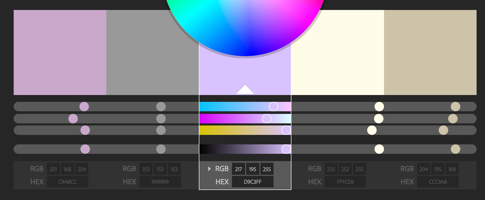
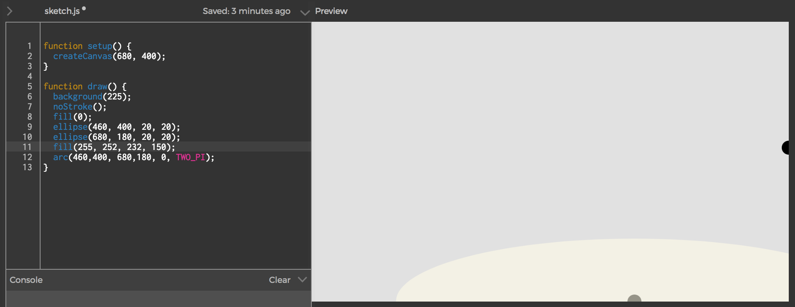
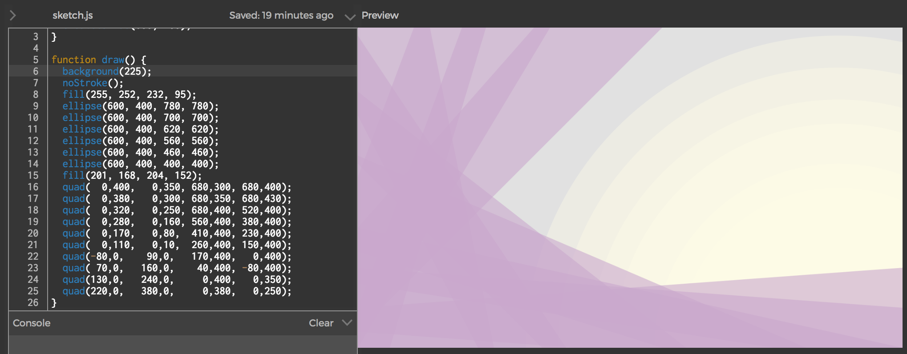

# Amazing and magnificent p5.js sunset

[Notes on the first class can be found here](https://github.com/nicolaspe/itp_icm/blob/master/class01/01_class.md)

## Drawing
For this assignment I wanted to try out the p5.js web editor. Usually, I write my code on Atom and save it on a Github repository, so losing that option and part of my work flow was disrupting. It was ok for this assignment, but for more complex things, I prefer working locally and having a version control. (Maybe I could save the final result on the web editor to share it more easily).

I want to create a landscape composition, using superposition of transparent objects to create the impression of light rays.

In order to have consistent and visually pleasing colors, I use this [Adobe Color Wheel tool](https://color.adobe.com/es/create/color-wheel/) to build a starting palette. The palette I started is the following:

Then, I tried using the `arc()` command to create the "sun" part without going outside the canvas size, but I didn't manage to understand how the command works. I actually tried using control points, but I still could not understand it. (I'd love to have a more didactic explanation about it on the reference page).

So, in the end, I just used the `ellipse()` function, overlapping several transparent circles.

Then, I wanted to create some overlapping lilac rays. As they wouldn't be perfect rectangles, I used the `quad()` function. I started with a horizontal one at the bottom of the screen and started moving it to the left and up. The last step to get the final picture, was calibrating the colors so everything would look good. That meant correcting the alpha values and making the background more bright. You can see the picture and script on the following [link](http://alpha.editor.p5js.org/nicolaspe/sketches/BJTKy71c-).

## How computation applies to my interests

- Write a blog post about how computation applies to your interests. This could be a subject you've studied, a job you've worked, a personal hobby, or a cause you care about. What projects do you imagine making this term? What projects do you love? (Review and contribute to the ICM Inspiration Wiki page. In the same post (or a new one), document the process of creating your sketches. What pitfalls did you run into? What could you not figure out how to do? How was the experience of using the web editor? Did you post any issues to github?
