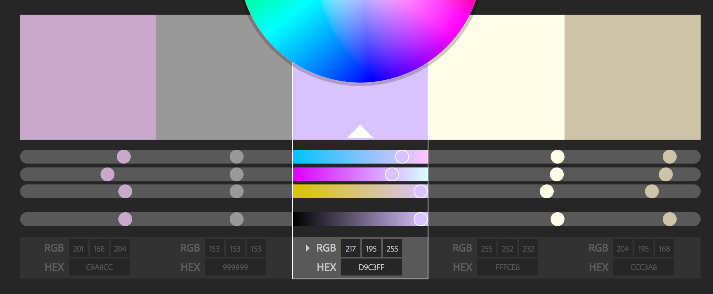
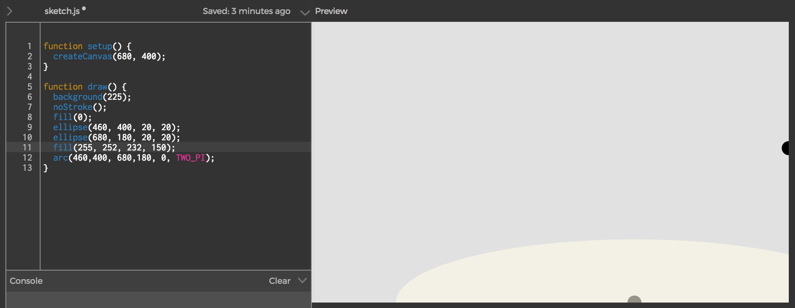
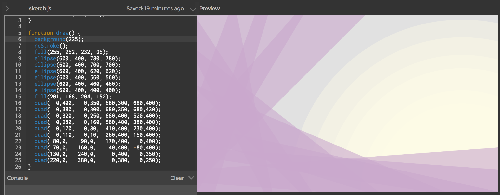

# Amazing and magnificent p5.js sunset

[Notes on the first class can be found here](https://github.com/nicolaspe/itp_icm/blob/master/class01/01_class.md)

## Drawing
For this assignment I wanted to try out the p5.js web editor. Usually, I write my code on Atom and save it on a Github repository, so losing that option and part of my work flow was disrupting. It was ok for this assignment, but for more complex things, I prefer working locally and having a version control. (Maybe I could save the final result on the web editor to share it more easily).

I want to create a landscape composition, using superposition of transparent objects to create the impression of light rays.

In order to have consistent and visually pleasing colors, I use this [Adobe Color Wheel tool](https://color.adobe.com/es/create/color-wheel/) to build a starting palette. The palette I started is the following:

Then, I tried using the `arc()` command to create the "sun" part without going outside the canvas size, but I didn't manage to understand how the command works. I actually tried using control points, but I still could not understand it. (I'd love to have a more didactic explanation about it on the reference page).

So, in the end, I just used the `ellipse()` function, overlapping several transparent circles.

Then, I wanted to create some overlapping lilac rays. As they wouldn't be perfect rectangles, I used the `quad()` function. I started with a horizontal one at the bottom of the screen and started moving it to the left and up. The last step to get the final picture, was calibrating the colors so everything would look good. That meant correcting the alpha values and making the background more bright. You can see the picture and script on the following [link](http://alpha.editor.p5js.org/nicolaspe/sketches/BJTKy71c-).

I would have liked to create a lot more lilac rays, but without recursion and variables it's way too much code to write.

## How computation applies to my interests

The main focus of my work is feminist social activism, for which I want to create content to push society to reflect on their privileges and stereotypes.

Volunteering in a feminist organization for the last year and a half has shown me the great impact of educating society and the transformations you can achieve. But, at the same time, I am aware of the limitations of traditional tools. Most social problems have much to do with empathy and are met with enormous resistance.

One of the best tools to bypass this opposition is storytelling, which effectively lowers those barriers and promotes empathy. It has a greater power to convey ideas, and by adding an interactive layer we involve the audience, creating a deeper immersion in the story

This is why I would like to enhance my passion in writing and storytelling with computation, in order to build captivating content, installations and performances to promote respect and fight oppression.
