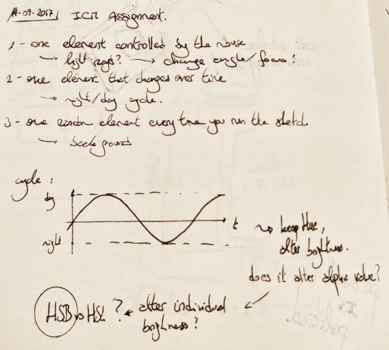
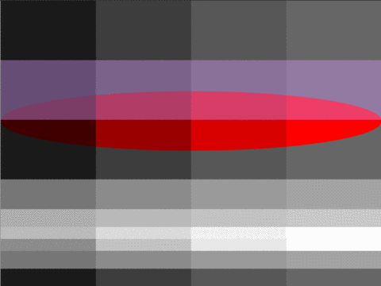
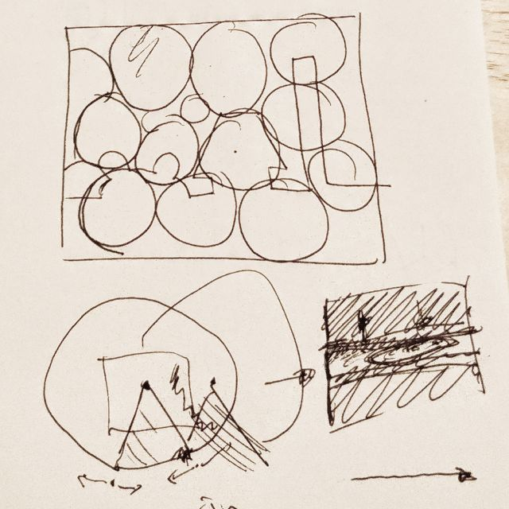
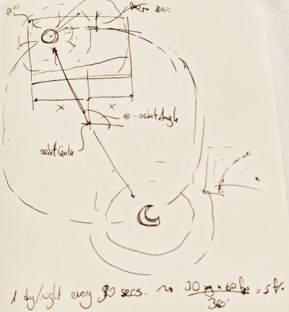

# A "light" problem

TL;DR you can see the script running [here](https://nicolaspe.github.io/itp_icm/class02/lightspace/index.html).

For this assignment I wanted to expand on [the first one](http://alpha.editor.p5js.org/nicolaspe/sketches/BJTKy71c-) and play with light sources and colors. Addressing the requirements, I wanted to use a mouse-controlled light source, on a background that has a day/night cycle and random elements to explore:
1. One element controlled by the mouse: light source(s)
2. One element that changes over time: day/night cycle
3. One element that changes every time you load the script: background elements



First of all, I had to explore on how to create a realistic approach to light with p5js. I did not want to overcomplicate things (I failed almost entirely in this), and only wanted to use simple 2D graphics. That means avoiding the use of textures and the `directionalLight()` functions from the WEBGL 3D graphics.

As this problem meant dealing with luminosity and brightness, my first task was exploring the differences between the HSL and HSB color modes. The most extreme solution I already had in mind was selecting the pixels on the way of the light and changing their brightness values individually. Thankfully there's an [extremely specific Wikipedia page](https://en.wikipedia.org/wiki/HSL_and_HSV#/media/File:Hsl-hsv_models.svg) that explained the difference between both modes with a really effective image. Due to my familiarity and because I think it was more suitable for this problem, I decided to use the HSB mode.


Next, I tried to experiment with the effects of overlapping transparency. For this, I created a [p5js sketch](http://alpha.editor.p5js.org/full/HkGHk_d5W) that features 3 levels of darkness (vertical rectangles with varying alpha levels) and 3 different "lights" (horizontal rectangles, also with transparency). Sadly, the results were not very satisfactory. While overlapping darkness is very effective, trying to cast a "light" as a transparency only creates a "fog" effect, further blurring the underlying objects.



This called for a new approach. One that would not mean treating the pixels individually. I mean, I could do it, but it's mostly a waste of time and I've got better things to do anyway (a.k.a: more assignments - did you expect anything else?). I started doodling possible approaches: How to deal with overlapping lights? How to deal with ONE light? Could I try to have darkness "zones" and shut them off if the light goes that way? Should I just try to "subtract" the darkness? The easiest answer was to "prevent" the darkness from appearing to simulate the light source.



Before I start experimenting with the light, I needed to setup the day/night cycle. The most direct way to do it was by setting up a sun and a moon orbiting the sketch. They would have a main circle to represent them, accompanied by some other circles to represent their brightness. To create the orbit, I just used a translation to it's origin, rotated by an amount that increases by 1/5 radians with every frame and drawing concentric circles at `(radius,0)`. The code for the sun drawing function can be seen after the image of the conceptual doodle for the orbit concept.



```
function drawSun(){
	// change coordinates
	push();
	translate(orbitCenter.x, orbitCenter.y);
	rotate(orbitAngle); // rotate angle
	// draw sun
	noStroke();
	fill(sun);
	ellipse(orbitRadius, 0, 100, 100);
	// draw overlapping circles
	fill(sun2);
	ellipse(orbitRadius, 0, 400, 400);
	ellipse(orbitRadius, 0, 340, 340);
	ellipse(orbitRadius, 0, 280, 280);
	ellipse(orbitRadius, 0, 220, 220);
	ellipse(orbitRadius, 0, 160, 160);
	// return coordinates
	pop();
}
```


```
function draw(){
	// basic calculations
	mPos = createVector(mouseX, mouseY);
	roboAngle = p5.Vector.sub(mPos, roboPos).heading();
}

function drawRobo(){
	// change coordinates
	push();
	translate(roboPos.x, roboPos.y +40*sin(roboVibe)/2);
	// calculate rotation
	rotate(roboAngle);
}
```


```
function drawDarkness(){
	// change coordinates
	// prepare & calculate colours
	noStroke();
	// transparency dependent on the position of the sun/moon
	darkAlpha = 50*sin(orbitAngle)+15;
	darkCol = color(315, 5, 27, darkAlpha);
	fill(darkCol);
	// draw
	arc(0, 0, 2*width, 2*width, PI/9, 17*PI/9);
	// return to coordinates
	pop();
}
```

The final code can be found [here](https://github.com/nicolaspe/itp_icm/blob/master/class02/lightspace/lightspace.js); and to see it working, [follow this other purple rabbit](https://nicolaspe.github.io/itp_icm/class02/lightspace/index.html).
