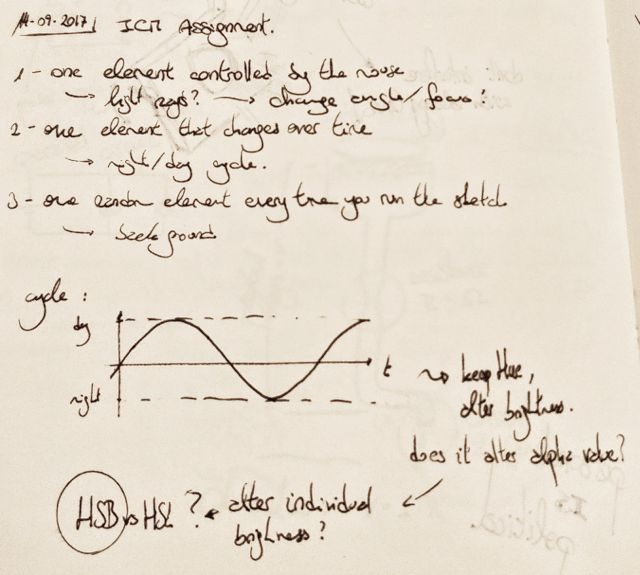
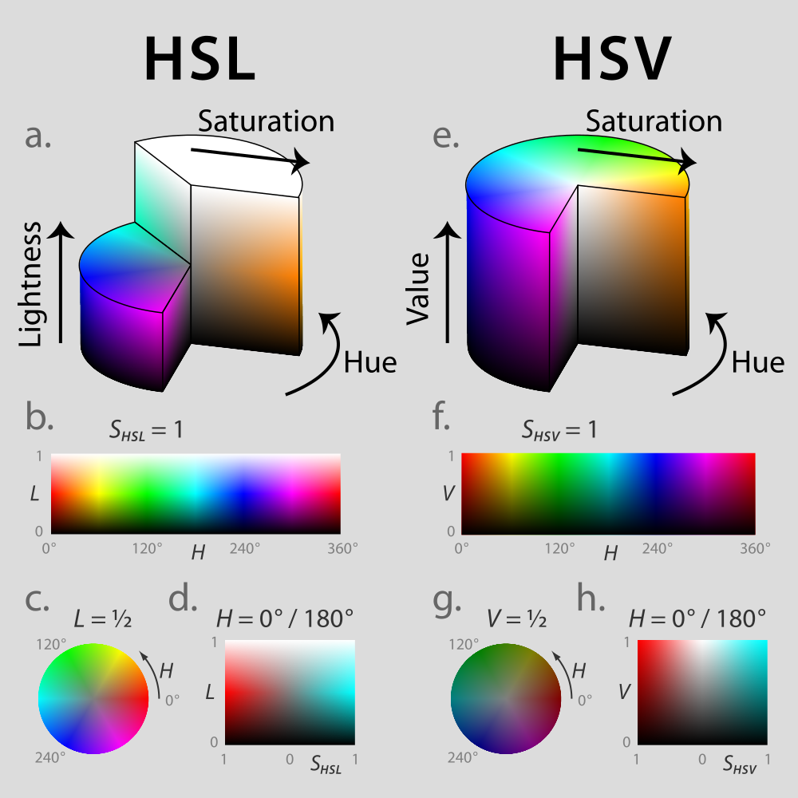
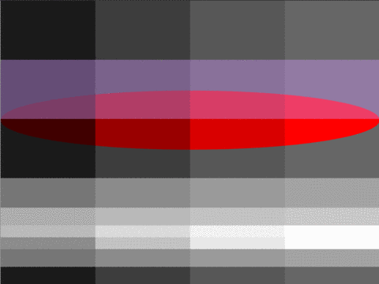
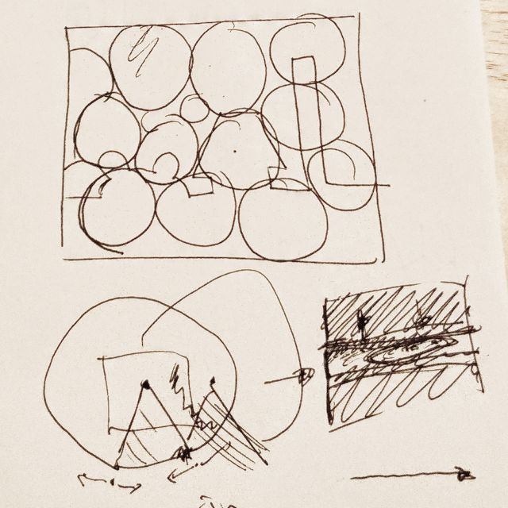
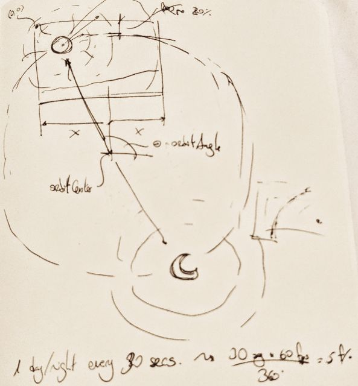

# A "light" problem

TL;DR you can see the script running [here](https://nicolaspe.github.io/itp_icm/class02/lightspace/index.html).

For this assignment I wanted to expand on [the first one](http://alpha.editor.p5js.org/nicolaspe/sketches/BJTKy71c-) and play with light sources and colors. Addressing the requirements, I wanted to use a mouse-controlled light source, on a background that has a day/night cycle and random elements to explore:
1. One element controlled by the mouse: light source(s)
2. One element that changes over time: day/night cycle
3. One element that changes every time you load the script: background elements



First of all, I had to explore on how to create a realistic approach to light with p5js. I did not want to overcomplicate things (I failed almost entirely in this), and only wanted to use simple 2D graphics. That means avoiding the use of textures and the `directionalLight()` functions from the WEBGL 3D graphics.

As this problem meant dealing with luminosity and brightness, my first task was exploring the differences between the HSL and HSB color modes. The most extreme solution I already had in mind was selecting the pixels on the way of the light and changing their brightness values individually. Thankfully there's an [extremely specific Wikipedia page](https://en.wikipedia.org/wiki/HSL_and_HSV#/media/File:Hsl-hsv_models.svg) that explained the difference between both modes with a really effective image. Due to my familiarity and because I think it was more suitable for this problem, I decided to use the HSB mode.



Next, I tried to experiment with the effects of overlapping transparency. For this, I created a [p5js sketch](http://alpha.editor.p5js.org/full/HkGHk_d5W) that features 3 levels of darkness (vertical rectangles with varying alpha levels) and 3 different "lights" (horizontal rectangles, also with transparency). Sadly, the results were not very satisfactory. While overlapping darkness is very effective, trying to cast a "light" as a transparency only creates a "fog" effect, further blurring the underlying objects.



This called for a new approach. One that would not mean treating the pixels individually. I mean, I could do it, but it's mostly a waste of time and I've got better things to do anyway (a.k.a: more assignments - did you expect anything else?). I started doodling possible approaches: How to deal with overlapping lights? How to deal with ONE light? Could I try to have darkness "zones" and shut them off if the light goes that way? Should I just try to "subtract" the darkness? The easiest answer was to "prevent" the darkness from appearing to simulate the light source.



Before I start experimenting with the light, I needed to setup the day/night cycle. The most direct way to do it was by setting up a sun and a moon orbiting the sketch. They would have a main circle to represent them, accompanied by some other circles to represent their brightness. To create the orbit, I just used a translation to it's origin, rotated by an amount that increases by 1/5 radians with every frame and drawing concentric circles at `(radius,0)`. The code for the sun drawing function (very similar to the moon drawing function) can be seen after the image of the conceptual doodle for the orbit concept.



```
function drawSun(){
	// change coordinates
	push();
	translate(orbitCenter.x, orbitCenter.y);
	rotate(orbitAngle); // rotate angle
	// draw sun
	noStroke();
	fill(sun);
	ellipse(orbitRadius, 0, 100, 100);
	// draw overlapping circles
	fill(sun2);
	ellipse(orbitRadius, 0, 400, 400);
	ellipse(orbitRadius, 0, 340, 340);
	ellipse(orbitRadius, 0, 280, 280);
	ellipse(orbitRadius, 0, 220, 220);
	ellipse(orbitRadius, 0, 160, 160);
	// return coordinates
	pop();
}
```

As I decided to address the lightning as a lack of darkness, now I had to decide what my light source would be. A lamp post would be too boring and I had to choose something that would fit any possible background and color combination. So a levitating explorer robot was the perfect choice. It could be a simple circle with a light emitting eye and it would look great.
For the levitation to look convincing, I needed the robot to move slightly up and down, so I added a time keeping variable (roboVibe) which was added to the y-position inside a sine function.
For the light, the interactive part of my sketch, I wanted to move it's direction onto different parts of the sketch, for which I needed to fix the robot and use the mouse position to guide it's vision. The easiest way to do this is with vector subtraction (between the robot's position and the mouse's) and the use of the `heading()` function. The following functions were used for all the robot's movements (these functions are not complete, they just show the part of the code corresponding to what I just talked about).

(For a strange reason, the web editor crashed and stopped working at this point. I ran the script on my computer and had no problem, so it's definitely it's problem. So long, web editor!)

```
function draw(){
	// basic calculations
	mPos = createVector(mouseX, mouseY);
	roboAngle = p5.Vector.sub(mPos, roboPos).heading();
}

function drawRobo(){
	// change coordinates
	push();
	translate(roboPos.x, roboPos.y +40*sin(roboVibe)/2);
	// calculate rotation
	rotate(roboAngle);
}
```

Finally, for the light and darkness bit I had to create a layer on top of everything to create the darkness, except where the robot is looking. Thus, it also needs to mimic the robot's position and rotation. The best way to approach it was to use the `arc()` function, leaving a small portion free of darkness. At the same time, I needed to change the transparency of that layer depending on the "time" of the day (kept and updated by the orbitAngle variable). That bit of code can be seen here:

```
function drawDarkness(){
	// prepare & calculate colors
	noStroke();
	// transparency dependent on the position of the sun/moon
	darkAlpha = 50*sin(orbitAngle)+15;
	darkCol = color(315, 5, 27, darkAlpha);
	fill(darkCol);
	// draw
	arc(0, 0, 2*width, 2*width, PI/9, 17*PI/9);
}
```

The background is just a superposition of rectangles and the small trees were made as several lines that change their rotation with a noise-generated variable. The final code can be found [here](https://github.com/nicolaspe/itp_icm/blob/gh-pages/class02/lightspace/lightspace.js); and to see it working, [follow this other purple rabbit](https://nicolaspe.github.io/itp_icm/class02/lightspace/index.html).
