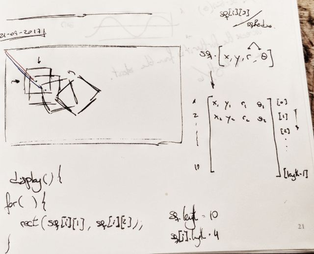
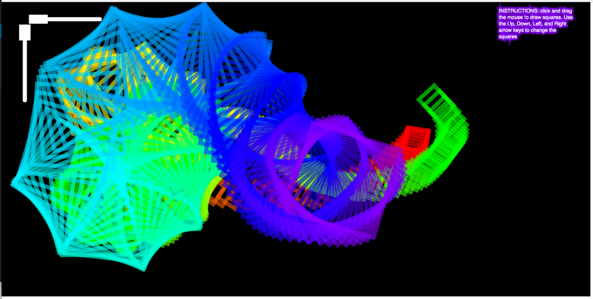

# Collaborating snakes

TL:DR, here's [the link](https://nicolaspe.github.io/itp_icm_snakeSkin/index.html) to the running sketch.

For this assignment we had to work in pairs, two people, could not do it by yourself. I partnered with [Caleb](http://calebfergie.com/), not only because he was sitting next to me, but mainly because I found really interesting his approach to his [last assignment](http://www.calebfergie.com/2017/09/18/where-is-waldo/).

We quickly reached an agreement for what to do: a set of rotating squares that appeared as the mouse was being dragged, something as trippy as possible.



We started by learning the notation for multidimensional arrays in p5js. We have an array of squares, where each square an array itself (as a way to avoid using objects, at least for now). The example squares we created for testing and the specific square drawing function can be seen here:
```
squares = []; // [x, y, rotation, radius]
sq1 = [100, 100, 0.2, sqRadius-30];
sq2 = [200, 100, 0.3, sqRadius-20];
sq3 = [300, 100, 0.4, sqRadius-10];
sq4 = [400, 100, 0.5, sqRadius];
squares = [sq1, sq2, sq3, sq4];

// This function draws every square contained in the "squares" array
function drawSquares(){
	for (var i = 0; i < squares.length; i++) {
		var col = color(squares[i][4], 100, 100, 60);
		stroke(col);
		push();
		translate(squares[i][0], squares[i][1]);
		rotate(squares[i][2]);
		rect(0, 0, squares[i][3], squares[i][3]);
		pop();
	}
}
```

With this part solved, we moved on to create the spin, shrink and create square functions, each one separately. This was only an expansion on our previous job. And, as we wanted to create a new square only when the mouse was being dragged, we used the `mouseDragged()` function to call the square creator.
```
// This is the built in mousedrag function
function mouseDragged(){
	var theta = radians(t);
	var h = t%360;
	createSquare(mouseX, mouseY, theta, sqRadius, h);
}
```

The next challenge was finding a way to remove the squares that disappeared from the array. Through a quick Google search we came up with [these set of examples](http://creative-coding.decontextualize.com/arrays-and-objects/) where our solution was waiting:
```
if(squares[i][3] <= 0){
	squares.splice(i, 1);
}
```

This ended the first day of intense work. We set everything up in a [github repository](https://github.com/nicolaspe/itp_icm_snakeSkin) so we could both expand on it. And we did perfectly! While I expanded on the color part of the sketch, Caleb created two sliders which control the two key aspects of the sketch: rotation and shrink rate. In the end, we can create wonderful shapes like the following.



The final code can be found [here](https://github.com/nicolaspe/itp_icm_snakeSkin/blob/master/snakeSkin.js).
