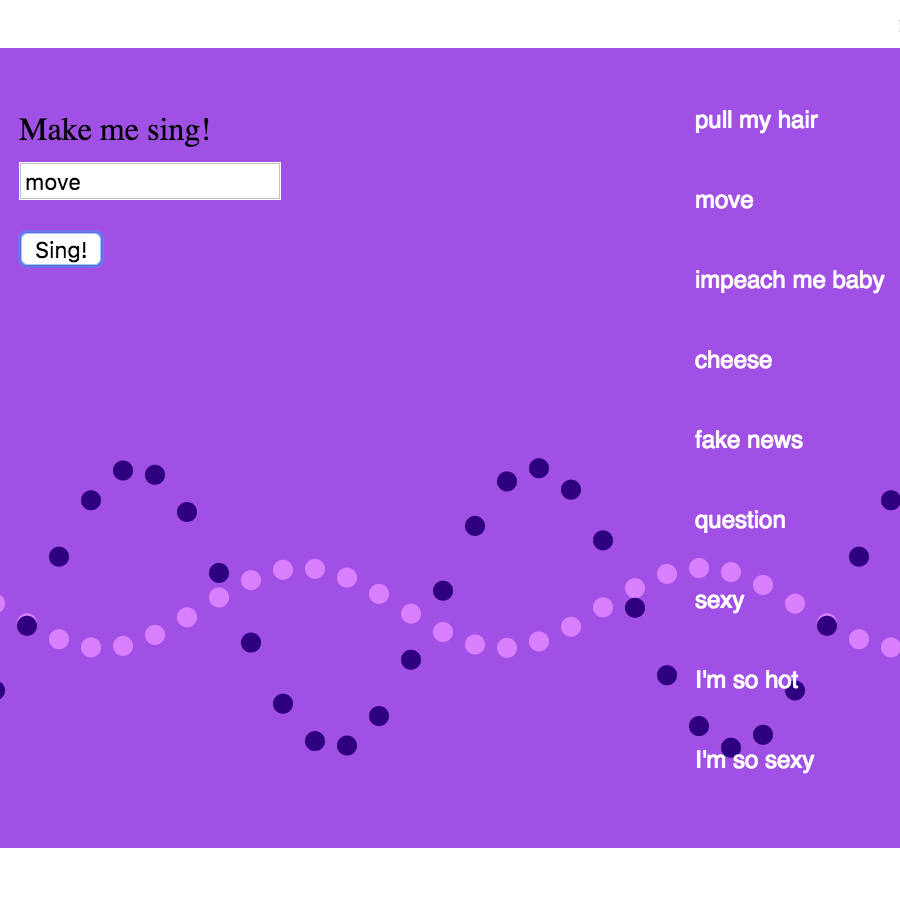
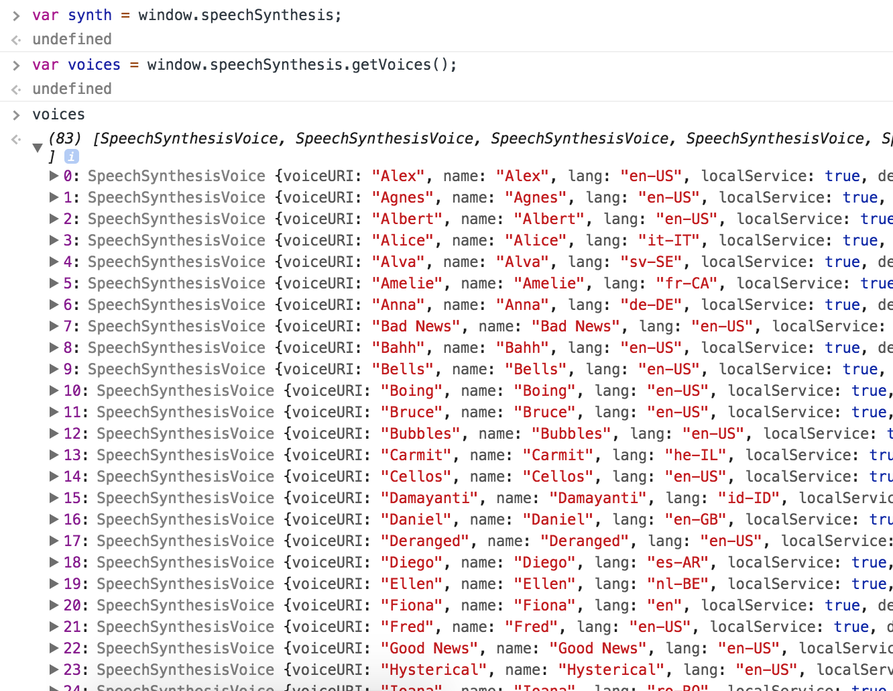

# Computer Duet

Made in collaboration with [Katya Rozanova](www.katyarozanova.com) for the [*New Musical Instruments Hackathon*](http://monthlymusichackathon.org/) - Oct 14, 2017.

The pressure of a hackathon, making everything in such a short amount of time was an amazing experience. It really helps you make quick decisions on what to fix and what to drop. We're extremely happy with the result, and if you don't want to read about this amazing process (TL;DR) [go ahead and play with this amazing shit](https://nicolaspe.github.io/computer_chorus).




## Coding for the choir

#### Initial idea and technical issues
From all the inspiring presentations and the things I've been reading, I really wanted to take a different approach to making a musical thingy. I wanted to deviate from the classical tonal music devices, which are awesome, but aren't that interesting for such an exploratory occasion. The ideas were about making something with noise or computer generated voices. So, we came to the idea of creating a computer chorus, where the user would input a text, select a pitch, and a chorus of computer voices would sing it.

One of the constraints was that it had to be a javascript library. In part, because it is what we're learning and it'd be more familiar, and also because we wanted it to be web-based.

We ended up using **[p5.Speech](http://ability.nyu.edu/p5.js-speech/)**, a p5 mask for [Google's Speech Synthesis API](https://developers.google.com/web/updates/2014/01/Web-apps-that-talk-Introduction-to-the-Speech-Synthesis-API). Actually, using that API directly (on Javascript) was our first choice, but we ran into some problems we thought were more easily solved on the p5 version... NOT!

The first problem was that the library didn't let us select a specific pitch. We could find only [one other library](https://github.com/usdivad/mesing) that had let you select the pitch, but both the speech and the code were unintelligible. We couldn't take the demo website apart to build something outside that framework. At the same time, the p5 library does not let you have many voices speaking at the same time. When we tried it, we realized it fills a buffer and they speak one after the other. A full computer chorus was not doable 😞.

#### Implementation and more problems
Instead, we decided to create a duet, where a voice sings your input on a text box, and another voice responds with a random message. Implementing the skeleton of the idea was easy, but we wanted to make use of the many different voices the API has. And this proved to be problematic. The `listVoices()` function (`getVoices()` in the original Javascript API) takes some time to load. This function returns an array of the available voices, but we just had an empty array when trying to use it. We found later that a callback function is needed to know when this information is fully loaded. I'll need to learn how to do that, but for now we had to find a way to solve this issue.



We tried setting up the variable initializations in different places around the code, giving them "more time" to get the info, to no avail. We fixed it by creating a button that switched the computer responding voice, but we couldn't change the first voice. From our observation, it seems like you cannot have two "instances" of a p5.Speech object that request information from the API. We had to conform with being able to change only one voice, so we chose the computer backing voice for this.


## Messages
At the same time, we had to come up with a list of messages for the responses. From just playing with the API while testing, we had the idea of having "sexy" responses, like *"yeah baby"*, *"oh oh oh"* and *"all night long"*. But having only that was not good enough, so we added a politic approach, mixing messages like *"impeach me baby"* and *"global warming"*. The list is a work in progress, so expect new content!


## Visualization
Katya came with an idea of displaying two sine waves, which get altered whenever each of the characters sing. We based this visualization on the [sine wave p5js example](https://p5js.org/examples/math-sine-wave.html).

Making two overlapping waves that go in opposite directions was a bit tricky, but changing a sign was enough to get it done.

```
function calcWave() {
  // initializations
  let theta = 0;
	let x = 0;
	theta += singerTheta;

  // For every x value, calculate a y value with sine function
	x = theta;
  for (let i = 0; i < singerValues.length; i++) {
    singerValues[i] = sin(x)*singerAmplitude;
    x+=dx;
  }
	singerTheta -= 0.01;

	// variables reset
	theta = 0;
	theta += chorusTheta;
	x = theta;
	for (let i = 0; i < chorusValues.length; i++) {
    chorusValues[i] = sin(x)*chorusAmplitude;
    x-=dx;
  }
	chorusTheta += 0.01;
}
```

#### More function callbacks
Setting up the callback functions `onStart()` and `onEnd()` wasn't very easy. I didn't know the specific syntax, so I had to try a few things with no result. I went to the reference page and realized they were properties, it was easier to setup.

```
// setup singers and start and end functions
soloSinger = new p5.Speech();
soloSinger.onStart = exciteSinger;
soloSinger.onEnd = calmSinger;

chorusSingers = new p5.Speech();
chorusSingers.onStart = exciteChorus;
chorusSingers.onEnd = calmChorus;
```

But this didn't solve everything... I realized I had the same problem that I had with the voices setup. Only the last p5 speech object can be updated and use these functions.

I don't really know why, but I had to find a workaround. I solved this by linking the singer wave to start when the button is clicked, and it stops with the chorus onStart event, leading to the chorus wave visualization to take place as it should.


## Future upgrades
In the short(?) future, we would like to:
- link the "Enter" key with the "Sing!" button
- update the visuals (make it look prettier!)
- make the actual chorus! (somehow)

And we'll probably keep on tweaking bits and pieces over and over again.


## Links
Here are the links for the [computer duet](https://nicolaspe.github.io/computer_chorus) and [code + repository](https://github.com/nicolaspe/computer_chorus)
